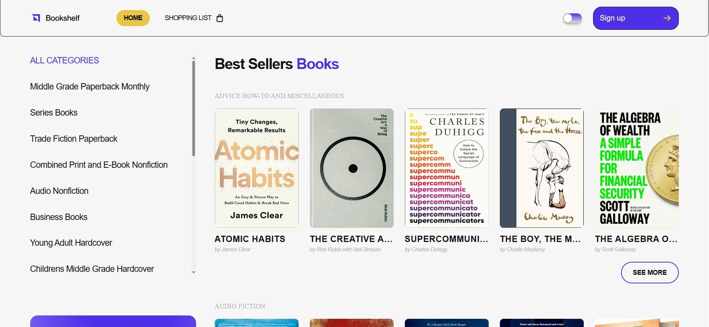
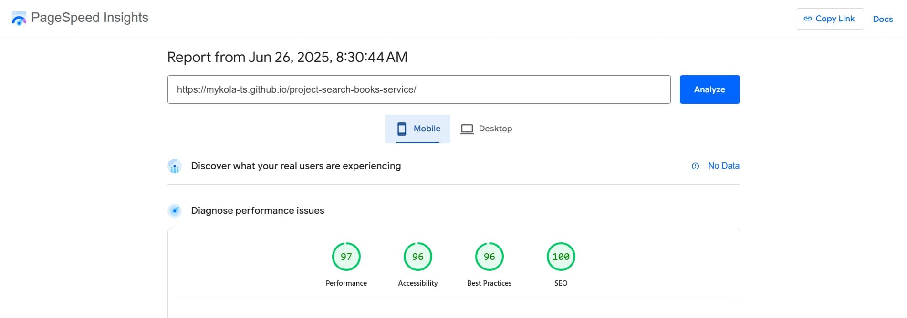
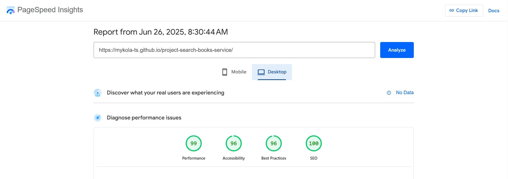
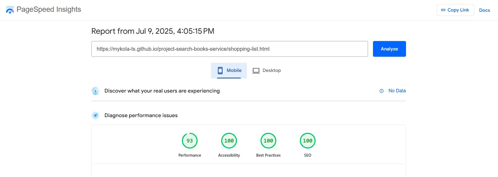
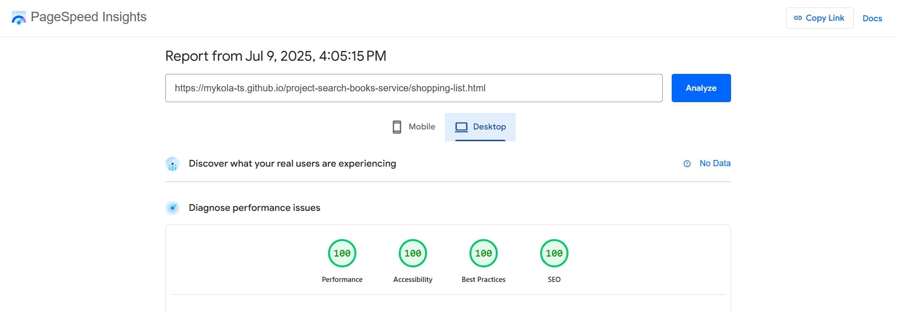
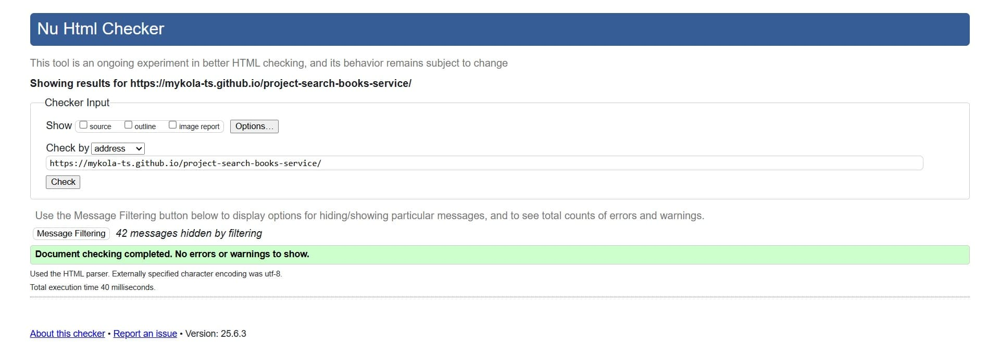
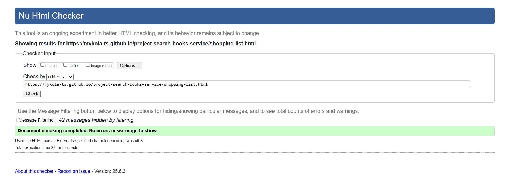

# Bookshelf

Discover and explore thousands of books with ease. Create an account, build your
personal reading list, and access detailed information with direct links to
purchase your next favorite read.


## Table of Contents

- [About the Project](#-about-the-project)
- [Website Structure](#-website-structure)
- [Useful Links](#-useful-links)
- [Technologies Used](#-technologies-used)
- [Libraries Used](#-libraries-used)
- [Folder and File Structure](#-folder-and-file-structure)
- [Features](#-features)
- [PageSpeed Results](#-pagespeed-results)
- [Validation Result](#-validation-result)
- [Installation & Setup](#-installation--setup)
- [Author](#-author)

## About the Project

This project is a responsive two-page website developed for the book discovery
service **Bookshelf**. It allows users to search for books, view detailed
descriptions, register or log in, and manage a personal shopping list in a clean
and intuitive interface. The website also features a “Support Ukraine” section
with a list of verified charitable foundations.



## Website Structure

The website consists of two pages:

**Home Page** — the main search and discovery interface for books, where users
can browse by categories and view book details in a modal window.

**Shopping List Page** — a personalized space where users can save books of
interest.

Each page includes the following sections:

**Home Page**:

- **Header** — contains the site logo, a theme toggle (light/dark), navigation
  links to the homepage and the shopping list, and user authentication controls
  such as login/logout buttons or a user icon depending on the session state.

- **Mobile Menu** — a responsive navigation panel designed for mobile devices
  that slides in or toggles when the hamburger button is clicked. It contains
  links to the main site sections and closes when a link is selected or the
  close button is pressed, ensuring easy and intuitive navigation on small
  screens.

- **All Categories** — a sidebar section displaying a scrollable list of book
  categories. Allows users to filter books by genre or type. Selecting a
  category updates the main book list accordingly. Includes an "All Categories"
  option to reset the view.

- **Support Ukraine** — а vertical slider section featuring a list of verified
  charitable foundations supporting Ukraine. Encourages users to donate by
  providing direct links to official organizations. Displayed on both the
  homepage and the shopping list page.

- **List of Books** — a dynamic section that displays a collection of book cards
  based on the selected category. Each card includes the book cover, title,
  author, and a “Learn More” button that opens a detailed modal view.

- **Modal Window** — a pop-up window that appears when a user clicks on a book
  card (Quick View). It displays detailed information about the selected book,
  including its title, description, author, and purchase links. The modal also
  features a button to add the book to the shopping list, or remove it if it's
  already saved.

- **Scroll-Up Button** — a floating button that appears when the user scrolls
  down the page. When clicked, it smoothly scrolls the user back to the top,
  enhancing site navigation and user experience.

- **Loader** — a visually engaging loading animation designed as a book with
  turning pages. It appears while content is being fetched or processed,
  providing users with a clear and thematic indication that the system is
  working, enhancing user experience with a creative and relevant graphic.

- **Authorization Window** — a modal interface for user authentication,
  including login and registration forms. Powered by Firebase Authentication, it
  enables secure access and user session management across the site.

**Shopping List Page**:

- **Header** — remains consistent with the Home Page, containing the logo, theme
  switcher (light/dark mode), navigation links (Home / Shopping List), and user
  authentication controls (e.g., login/logout or user avatar if logged in).

- **Mobile Menu** — a responsive mobile navigation panel that toggles open and
  closed. Contains navigation links and closes automatically upon link selection
  or clicking the close icon. Ensures smooth mobile experience.

- **Support Ukraine** — same as on the Home Page, this vertical slider slider
  section that features verified charitable foundations supporting Ukraine. It
  includes direct links for donations to trusted organizations. This section is
  visible only on the desktop version of the site (on smaller screens it is
  hidden) to maintain layout clarity and avoid clutter on mobile and tablet
  views.

- **Shopping List** — the main section of this page, displaying a list of books
  the user has added. Each book entry includes the title, author, cover image,
  and purchase links. Users can remove books from this list directly. If no
  books are added, an empty state message is shown, encouraging users to browse
  and add books from the homepage.

- **Scroll-Up Button** — enhances usability by allowing users to quickly return
  to the top of the page when scrolling.

- **Loader** — animated loader styled like a flipping book appears when the page
  fetches data or performs actions (e.g., user authentication or list update),
  providing feedback and reinforcing the book-themed design.

- **Authorization Window** — same modal as on the Home Page, allowing users to
  sign in or register. Ensures access control and persistent user-specific data
  like the shopping list.

## Useful Links

- [Live Demo](https://mykola-ts.github.io/project-search-books-service/) —
  deployed version of the website

- [GitHub Repository](https://github.com/Mykola-Ts/project-search-books-service)
  — source code of the project

- [Figma Design](https://www.figma.com/design/J31Kn9h6Fuxq2FKA1S2IzM/Bookshelf--Copy-?node-id=0-1&p=f&t=Rgu72hWRE8pSYoAY-0)
  — the project’s UI/UX design mockup

## Technologies Used

- HTML5
- CSS3
- JavaScript (ES6+)
- Git / GitHub
- Vite — modern frontend build tool
- Axios — promise-based HTTP client for fetching data from external APIs
- Firebase — provides authentication, hosting, and potentially cloud storage via
  Firestore
- Notiflix — library for showing elegant notifications, loading indicators, and
  alerts

## Libraries Used

- [vite](https://vite.dev/) - next generation frontend tooling (dev server &
  build tool)
- [glob](https://www.npmjs.com/package/glob) - file path pattern matching (used
  for dynamic input in builds)
- [@fortawesome/fontawesome-free](https://www.npmjs.com/package/@fortawesome/fontawesome-free) -
  free icon set and toolkit
- [axios](https://axios-http.com/) - promise-based HTTP client for the browser
- [firebase](https://firebase.google.com/docs/web/setup) - backend-as-a-service
  (auth, Firestore, hosting, etc.)
- [modern-normalize](https://github.com/sindresorhus/modern-normalize) — CSS
  normalization to make built-in browser styling consistent
- [notiflix](https://www.npmjs.com/package/notiflix) - simple and elegant
  notifications and dialogs
- [vite-plugin-full-reload](https://www.npmjs.com/package/vite-plugin-full-reload)
  — hot reload for HTML and other non-JS files in Vite
- [vite-plugin-html-inject](https://www.npmjs.com/package/vite-plugin-html-inject)
  — inject variables or partials into HTML at build time

## Folder and File Structure

- **.github/**: GitHub-specific configuration and workflows.

- **assets/**: Folder stores images used in the README.md file to visually
  document and represent the project.

- **src/**: Folder contains the source code of the application, including all
  essential files such as HTML, CSS, JavaScript, and component logic used to
  build and structure the project:

  - **fonts/**: Custom fonts used in the project.

  - **img/**: Folder for images and icons used throughout the site.

  - **js/**: Contains JavaScript files for functionality.

  - **partials/**: HTML partials for each section of the site.

  - **public/**: Static assets for Vite (e.g., images, favicons, etc.).

  - **styles/**: CSS files for each section of the site.

  - **index.html**: The main HTML file for the site.

  - **shopping-list.html**: The second HTML file of the site. Displays the
    user's saved books in a shopping list.

- **.editorconfig**: Editor configuration file.

- **.gitignore**: Specifies which files and directories to ignore in Git.

- **.prettierrc.json**: Prettier configuration for code formatting.

- **package.json**: Contains metadata about the project and dependencies.

- **README.md**: Project documentation and setup instructions.

- **vite.config.js**: Configuration file for Vite.

## Features

- **Responsive Design**  
  Website adapts to different screen sizes: desktop, tablet, and mobile.

- **Light and Dark Theme Toggle** Users can switch between light and dark modes
  to suit their preference and improve readability.

- **User Authentication** Users can register and log in via Firebase
  authentication for a secure personalized experience.

- **Support Ukraine Section** Dedicated block featuring a curated list of
  charitable foundations supporting Ukraine.

- **Category Filtering** Ability to filter the displayed books by categories for
  easier navigation and discovery.

- **Book Details Modal** Detailed modal window opens with book description and
  an Add to Shopping List button for quick interaction.

- **External Purchase Links** Book modal windows and shopping list items include
  direct links to popular marketplaces like Amazon, Apple Books, and Barnes &
  Noble.

- **Persistent Shopping List** Authorized users can add books to their shopping
  list, which is saved in the cloud and accessible from any device after login.

- **Mobile Menu**  
  Slide-in mobile navigation menu with backdrop and proper event handling. Menu
  automatically closes when clicking on a nav-link or on the close button.

- **Keyboard Accessibility**  
  Modal window and navigation elements are accessible via keyboard (e.g. Esc to
  close modals).

- **Scroll Up Button**  
  Enhances navigation and usability, especially on long or content-heavy pages.
  Appears when scrolling down and allows users to quickly return to the top of
  the page.

- **Clean & Modular Code**  
  Code is split into logical modules.

- **Performance & Accessibility**  
  The website achieves high performance, accessibility, best practices, and SEO
  standards. Optimized code and structure ensure fast loading, smooth
  interactions, and an inclusive, user-friendly experience across all devices.

## PageSpeed Results

Google's PageSpeed Insights was used to analyze the performance of the
TheWatchSpot website on both mobile and desktop devices. The results highlight
strong performance across various categories, ensuring a smooth user experience.

**Home Page**

- **Mobile Performance:**



- **Desktop Performance:**



**Shopping List Page**

- **Mobile Performance:**



- **Desktop Performance:**



These results demonstrate that the website is optimized for both performance and
user experience, ensuring fast loading times and high usability on all devices.

## Validation Result

The website has been tested with the
[W3C Markup Validation Service](https://validator.w3.org/) and contains no
validation errors or warnings.

**Home Page**



**Shopping List Page**



## Installation & Setup

To run the project locally, follow these steps:

1. **Clone the repository**
   ```bash
   git clone https://github.com/Mykola-Ts/project-search-books-service.git
   cd project-search-books-service
   ```
2. **Install dependencies**

   ```bash
    npm install
   ```

3. **Start the development server**

   ```bash
    npm run dev
   ```

4. **Open in browser**

Visit http://localhost:5173/ to view the project.

## Authors

- **Mykola Tsybulskyi** (Team Lead + Modal Window)

  - GitHub https://github.com/Mykola-Ts

  - Email tsybulskiyk@gmail.com

  - LinkedIn https://www.linkedin.com/in/mykola-tsybulskyi

- **Oleksandr Grogul** (Scrum Master + Authorization)

  - GitHub https://github.com/groguls

  - Email groguls@gmail.com

- **Serhii Korchma** (Header section)

  - GitHub https://github.com/pro100ergeyko

  - Email serg.korchma@gmail.com

- **Maryna Udovychenko** (Shopping List page)

  - GitHub https://github.com/Marini23

  - Email marina.smile1m@gmail.com

- **Igor Botvuna** (Support Ukraine section)

  - GitHub https://github.com/Igorippon

  - Email botvunaigor@gmail.com

- **Evhenii Yahich** (Loader + Scroll Up)

  - GitHub https://github.com/EvhYa

  - Email nicetea.bro@gmail.com

- **Oleksandr Filippov** (All Categories section)

  - GitHub https://github.com/AlexFilippov777

  - Email 7philipps7@gmail.com

- **Irina Antonishina** (Mobile Menu)

  - GitHub https://github.com/IrinaAntonishina
